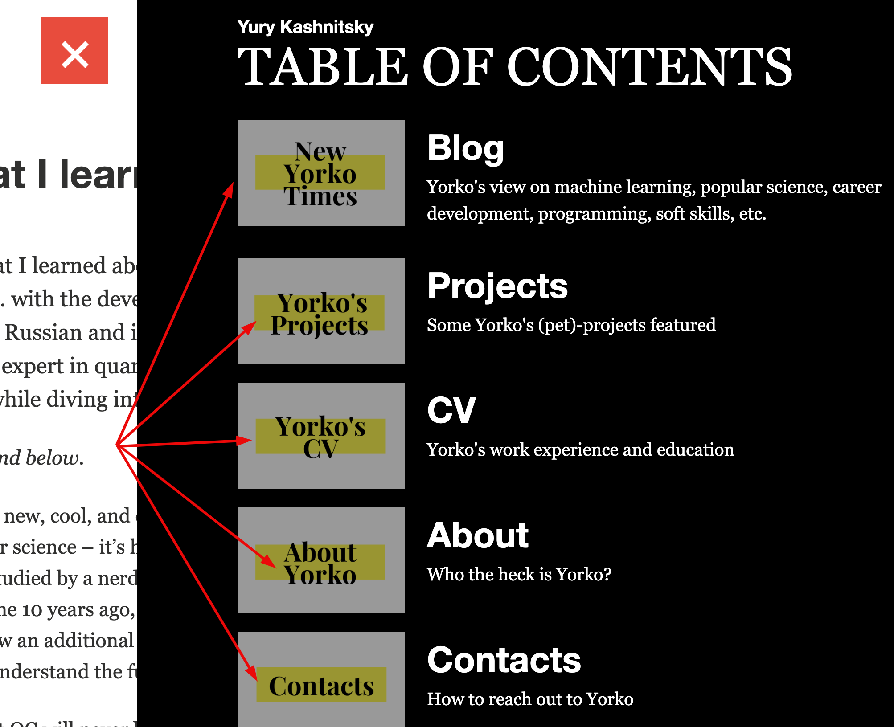

# Yorko's blog 

Here the code for my personal website is stored.

## Source

[`_config.yml`](_config.yml) – project-level configurations.

### Posts

Posts should be added as `_posts/YYYY-MM-DD-title.md`, e.g., `_posts/2022-11-09-vapnik-jackel-bet.md`

### Pages

The tabs on top (CV, Projects, etc) correspond to the documents in the [_pages](_pages) folder.

### Navigation

The navigation block is controlled via the [`_data/navigation.yml`](_data/navigation.yml) file.

Footers are set up in the [`_data/footers.yml`](_data/footers.yml) file.

### Images

Images are stored in the [images](images) folder, there are subfolders per post.

### Google Analytics 4

Just putting the GA measurement ID into `_config.yaml` didn't work, so I inserted and identical [code snippet](https://analytics.google.com/analytics/web/?authuser=0#/a186888467p342067860/admin/streams/table/4278260341) into each `_site/*.html` page. 

## Building

- `bundle install`
- `bundle exec jekyll build`
- `bundle exec jekyll serve`

For development, tou can run the last command, make updates, and track the result at [localhost:4000](http://localhost:4000/)

